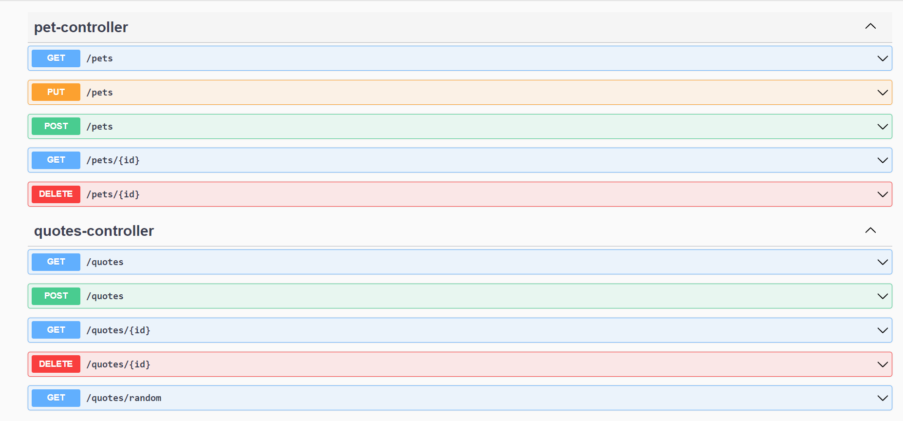

# Spring-boot-quotes-qr

## API uses:
    > CSV file that contains 676 the most known quotes
## Run process:
    > Get all quotes from file and contain them on H2 database
    > By using specific endpoints API returns basic operations like add / getAll / getById / update and so on
    > 
    > In default endpoint API get random quote from db and print it in QRCode form
